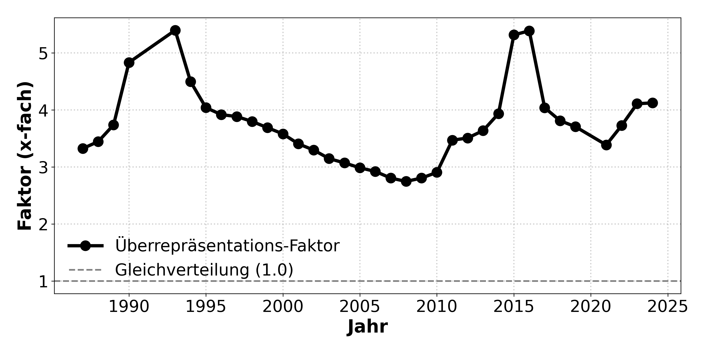
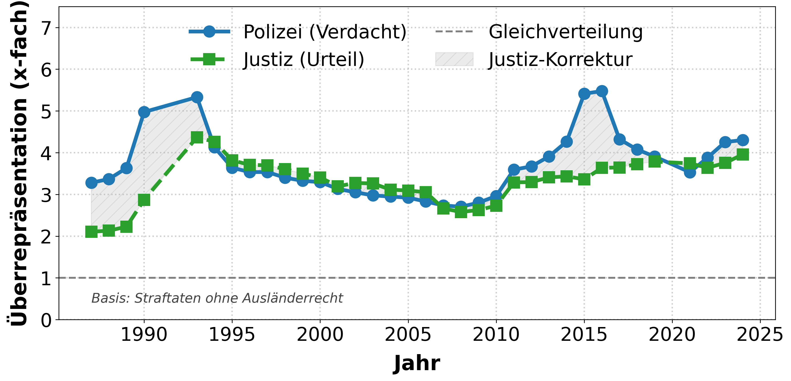
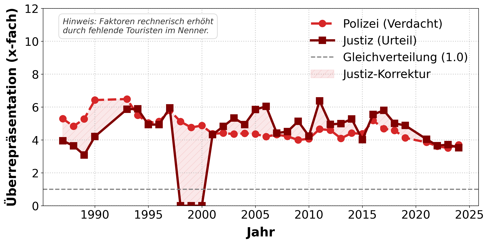
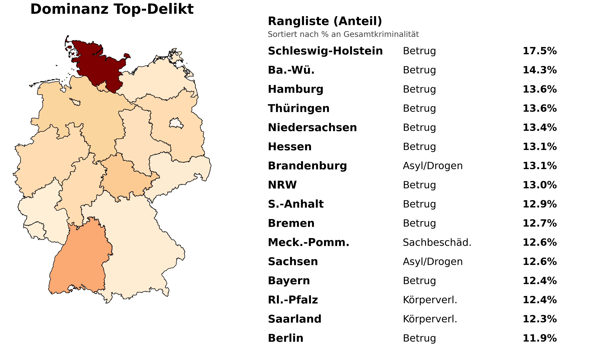

# Kriminalitätsanalyse: Überrepräsentation nach Nationalität

Big-Data-Projekt zur Analyse von Kriminalitätsdaten in Deutschland unter Verwendung von PySpark. Das Projekt vergleicht Tatverdächtige und Verurteilungen zwischen deutschen Staatsbürgern und Nichtdeutschen auf Basis offizieller Destatis-Daten (PKS, Justizstatistik, Strafvollzug, Bevölkerung).

## Projektstruktur

```

Notebooks/
├── 01_Datenaggregation_Vorverarbeitung.ipynb      # Destatis-Download (Bevölkerung, Justiz, Gefängnis)
├── 01_Datenaggregation_Vorverarbeitung_PKS.ipynb  # PKS-Daten verarbeiten
└── 02_Analysis_and_Plotting.ipynb                 # Hauptanalyse + Plots
src/
├── config_local.py          # Spark-Session-Config
└── __init__.py
data/
├── raw/                     # Rohdaten (CSVs, Excel)
└── processed/               # Parquet-Dateien (von Notebooks erzeugt)
output/                      # Generierte Plots (PNG, 300 dpi)
environment.yml              # Conda-Umgebung
.gitignore
```

## Setup

1. **Conda-Umgebung erstellen:**
   ```bash
   conda env create -f environment.yml
   conda activate bigdata_project
   ```

2. **Datenzugriff & API-Konfiguration**
   
   Das Repository enthält im Ordner `data/raw` bereits initiale Daten für die PKS und die Heatmap. Für den vollständigen ETL-Prozess und die Zeitreihenanalyse müssen die Hauptdaten jedoch dynamisch nachgeladen werden.

   Hierfür ist ein **API-Token** des Statistischen Bundesamtes erforderlich:
   
   - **Registrierung:** Erstellen Sie einen kostenlosen Account auf [Genesis-Online](https://www-genesis.destatis.de/datenbank/online#modal=login,register).
   - **Token:** Nach der Anmeldung können Sie ein persönliches Token generieren.
   - **Integration:** Fügen Sie die Zugangsdaten im Notebook 01_Datenaggregation_Vorverarbeitung.ipynb im initialen Setup von Spark ein, um den Download zu authentifizieren.

3. **Notebooks ausführen (in dieser Reihenfolge):**
   - `01_Datenaggregation_Vorverarbeitung.ipynb` → lädt Destatis-Daten herunter und erzeugt .parquet Dateien
   - `01_Datenaggregation_Vorverarbeitung_PKS.ipynb` → verarbeitet PKS-Excel-Dateien
   - `02_Analysis_and_Plotting.ipynb` → erzeugt finale Plots

## Workflow

### 1. Datenakquise und Preprocessing
Die Notebooks laden und bereinigen Daten von der Destatis Genesis-API bzw. verarbeiten Excel-Dateien:
- **Bevölkerung** (12411-0002): Deutsche/Nichtdeutsche nach Jahr
- **Justiz** (24311-0002): Verurteilungen nach Nationalität, Geschlecht, Straftat
- **Gefängnis** (24321-0001): Inhaftierte nach Nationalität
- **PKS**: Polizeiliche Kriminalstatistik (Tatverdächtige)

Ergebnis: Parquet-Dateien in `data/processed/` für schnellen Zugriff.

### 2. Analyse und Visualisierung
Das Hauptnotebook berechnet Überrepräsentationsfaktoren:

**Formel:**  
`Faktor = (Straftaten_Nichtdeutsche/ Bevölkerung_Nichtdeutsche) / (Straftaten_Deutsche / Bevölkerung_Deutsche)`

Ein Faktor von 1.0 bedeutet Gleichverteilung. Werte >1.0 zeigen Überrepräsentation von Nichtdeutschen, Werte <1.0 Unterrepräsentation.

## Ergebnisse

### PKS-Zeitreihe (1987-2024)
Entwicklung des Überrepräsentationsfaktors über alle Straftaten hinweg:



### PKS vs. Justiz (bereinigt)
Vergleich zwischen polizeilichem Tatverdacht und tatsächlichen Verurteilungen (ohne Ausländerrecht-Delikte wie Aufenthalt/Asyl):



### Vergewaltigung: Bias-Check
Spezifische Analyse eines Deliktbereichs mit Hinweis auf statistische Verzerrung durch fehlende Touristen-Berücksichtigung:



### Gefängnis-Vergleich
PKS-Verdacht vs. tatsächliche Inhaftierung (ab 2017 wegen Zensus-Bruch):


### Choroplethenkarte Deutschland
Dominantes Delikt pro Bundesland nach Anteil an Gesamtkriminalität:



## Dependencies

- **Python 3.10**
- **PySpark** (lokaler Modus, 8GB RAM)
- **Pandas** (Datenmanipulation)
- **Matplotlib** (Paper-Grafiken, IEEE-Format)
- **Geopandas** (Choroplethenkarte)
- **OpenJDK 17** (für Spark)
- **openpyxl** (Excel-Dateien)
- **requests** (Destatis API)

Siehe `environment.yml` für vollständige Liste.

## Technische Details

- **Spark-Session:** Lokal mit `local[*]`, 8g Driver Memory, 200 Shuffle Partitions
- **Plot-Stil:** Hochauflösend (300 dpi), IEEE-Konferenz-Format
- **Datenformat:** Parquet für schnelle I/O-Operationen

## Hinweise

- Berechnete Faktoren können durch Touristen-Kriminalität (nicht in Bevölkerungsstatistik) verzerrt sein
- Ausländerrecht-Delikte werden in den Hauptanalysen herausgefiltert, da diese strukturell nur Nichtdeutsche betreffen
- Zensus 2011 führt zu Bevölkerungsbruch → Gefängnis-Analyse erst ab 2017
